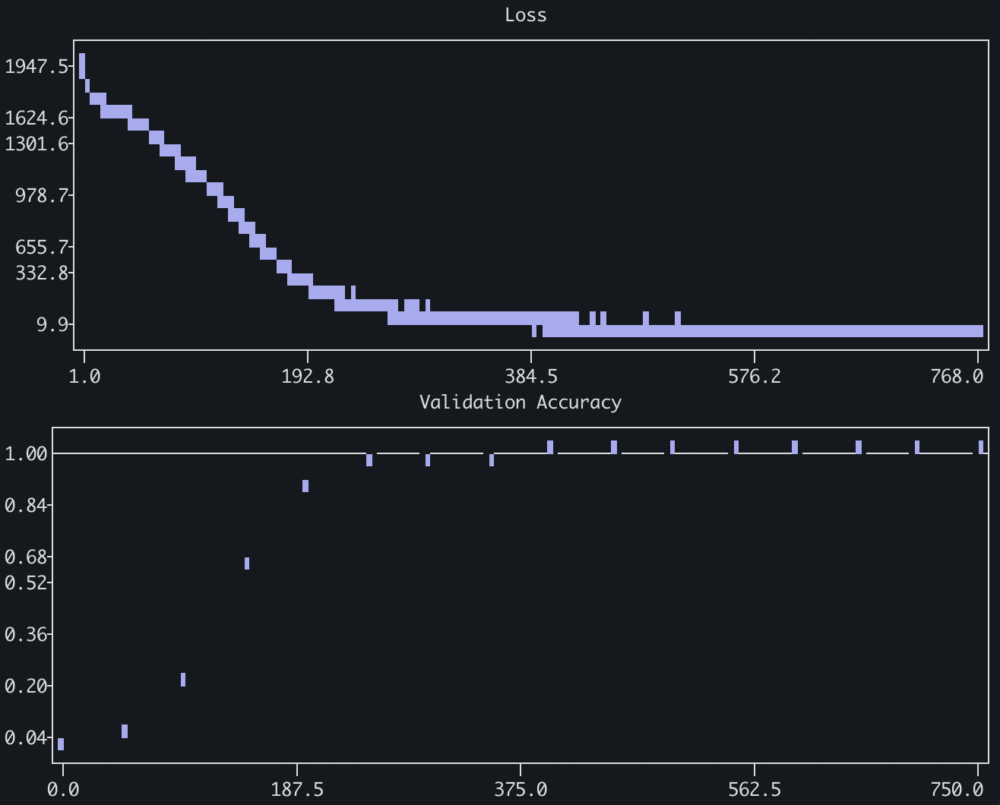

# From Scratch

> You don't know something until you've built it yourself from scratch! 

One day I would like to implement the whole language model stack from the bottom to the top, including the actual computer running it: like, operating system, up to cuda kernels, up to architecture, optimizers, and training algorithms. Today is not really that day. But one day this repo may eventually house all of that!

This repo contains, at the moment, bare-pytorch implementations of as many parts of the LLM stack as I can make, written by me by hand. Bare pytorch means I will use torch's basic computational primitives (e.g. `torch.sum` up to `Modules` and `Parameters`), but will not use any built in architectural components (e.g. `torch.nn.Linear`), optimizers, et cetera. The goal is to understand the process end-to-end. (I'd even like like to reduce or eliminate my dependence on Torch altogether --- write my own autodiff, kernels, et cetera --- but that's a long way down the road.) Eventually, I'll be using open data sources and following open research (e.g. OLMO, DeepSeek technical reports) to try and train my own langauge model. You might compare with Andrej Karpathy's Micrograd/NanoGPT projects but I did it myself so it's different and moderately worse.

This repository contains *atelic* software: software built where the purpose lies in the process of building, not the end result. To repeat again, all code is be written by hand by me!

## Rules

### LLM Help
All code is written by hand. Language models may be consulted as tutors but may not edit any files directly. Acceptable uses:

- They may be consulted for conceptual help, and may supply equations. Humans must turn those equations into code.
- They may be asked for debugging help, in which case they can give a line number and *if absolutely necessary* a hint at the fix, if something is broken. Debug help should be reserved as a last resort; you should debug everything yourself.
  - So far I have consulted LLM debug `0` times as of 2026-07-12.
- LLMs may be asked for code feedback, **once implementation of a component is finished**. 

### Imports

All external imports route through a single main list in `tools/__init__.py`, exact package names are required so we can see every single import we use.

Most packages stay named with `tls` e.g. `tls.einsum`; some things e.g. `Module`, `Tensor` I just really don't want to have to write `tls` in front of so I'm being lazy. Maybe I will regret this at some point. Who knows!

Everything that I have built myself will have a specific directory.

### Package management 

Everything is always run through `uv`.

## Structure

I don't really know *a priori* how this is going to be structured so this will change over time, but here is my guess for now:

`/architecture`: whole architectures
`/architecture/layers.py`: layers that go into architectures (will probably get moved at some point but for now is all in one file)
`/training/scripts`: scripts for actually running 
`/training/optimizers.py`: optimizers
`/training/losses.py`: losses
`/inference`: for running inference

In pytorch, I'd like to implement architectural components, optimizers, losses, training scripts, parallelization, et cetera, and then train my own model from scratch using it all.

At some point I would like to use JAX for a mini implementation of e.g. an MLP and train it on CIFAR so that I can understand everything 'as it truly is' (in the mathematical sense) but in order to get started I am going to do it in torch.

I want everything to feel nice when importing. e.g. `from training.optimizers import cross_entropy` or something like that.

